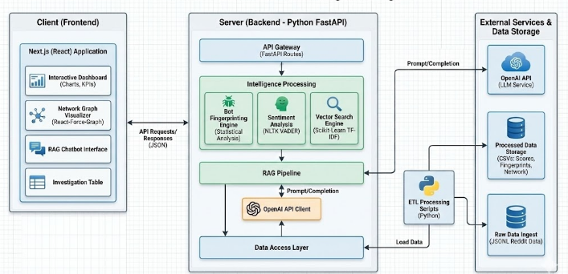
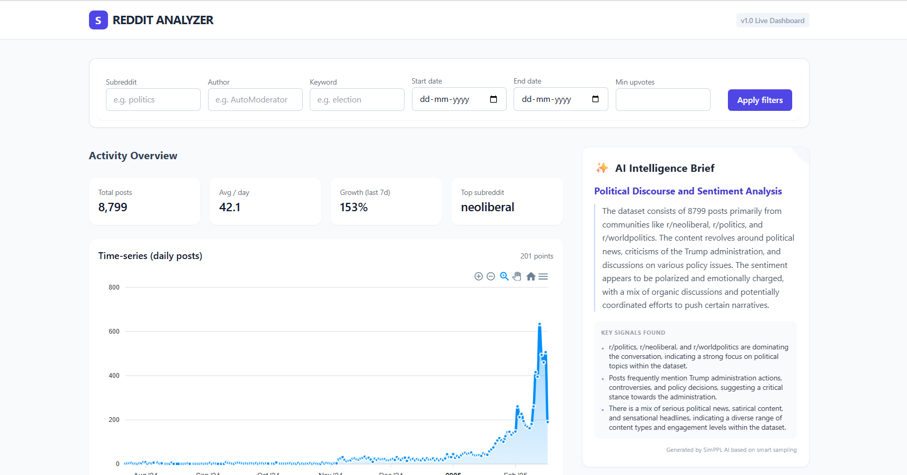
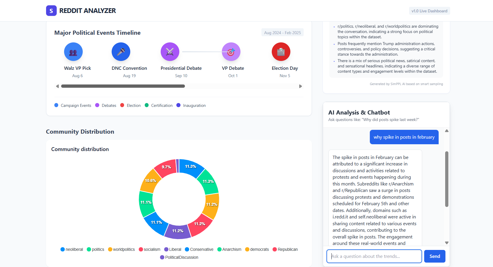
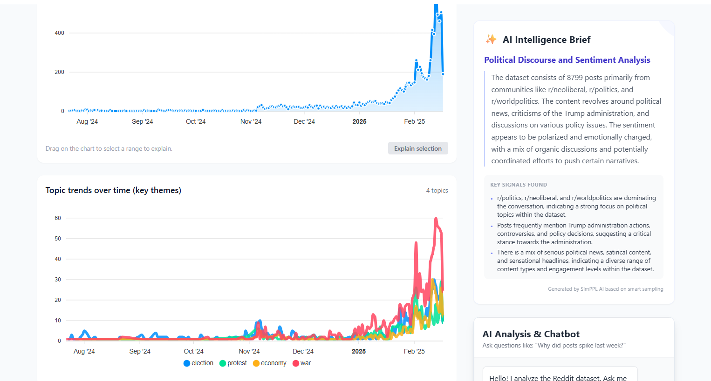
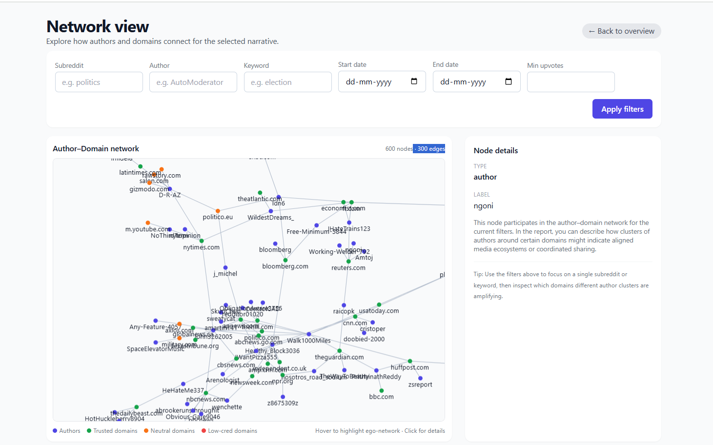
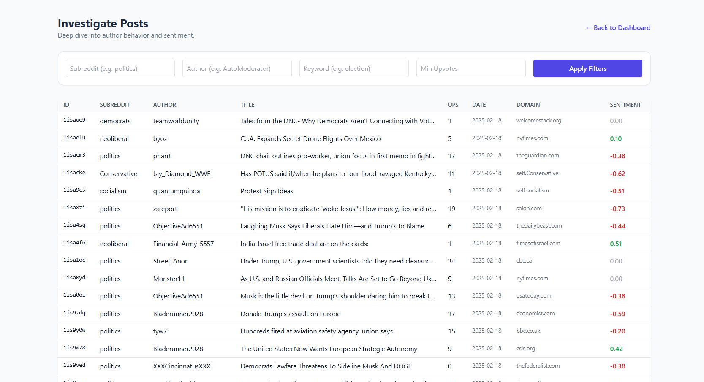

# RedOptic- Reddit Analyzer

 
 


## Introduction
**RedOptic** is a forensic social intelligence engine designed to decode the hidden infrastructure of Reddit narratives. Instead of focussing on vanity metrics(likes/shares),it focuses on **credibility and authenticity**.

The system ingests raw social data to perform real-time "bot fingerprinting" and network analysis, distinguishing between organic grassroots discussion and coordinated inauthentic behavior. It features a custom **Retrieval-Augmented Generation (RAG) chatbot** that allows investigators to interrogate the dataset in natural language, backed by a rigorous Python statistical backend.
## Live Deployment
[](https://redditanalyzersimppl.vercel.app)

## Key Features

- AI-driven analytical chatbot that answers questions over the Reddit dataset using semantic search and LLM reasoning.
- Flexible post filtering engine supporting subreddit, author, keyword, date range, and engagement thresholds.
- Time-series analytics for tracking post volume and temporal trends across the dataset.
- Topic trend detection based on curated keyword groups to highlight evolving themes.
- Dataset-wide sentiment scoring using VADER to capture polarity of discussions.
- KPI and ranking endpoints for top subreddits, authors, domains, and activity metrics.
- Author and domain credibility scoring using behavioral signals and source reliability labels.
- Network graph generation linking authors to domains to reveal relationship structures and influence patterns.
- TF–IDF based semantic search endpoint for relevance-oriented retrieval of posts.
- AI-powered dataset summarization that produces concise headlines, analytical summaries, and evidence points.

## System Architecture



- **Frontend**: Next.js (React) for a responsive, interactive dashboard using Tailwind CSS and Recharts.
- **Backend**: Python FastAPI server handling data processing, vector search, and API routing.
- **Data Layer**: Pandas for high-speed data manipulation and Scikit-Learn for TF-IDF vectorization.
- **AI Engine**: OpenAI GPT-3.5 Turbo for synthesis and NLTK for sentiment analysis.

## Folder Structure

```
├── client/                  # Frontend Application (Next.js)
│   ├── components/          # Charts, Graphs, and UI elements
│   ├── pages/               # Dashboard and Investigate views
│   └── styles/              # Tailwind CSS configuration
│
├── ai_server/               # Backend Application (FastAPI)
│   ├── main.py              # API Endpoints and Logic
│   ├── services/            # Data Loaders and AI Clients
│   └── .venv/               # Python Virtual Environment
│
├── data/                    # Dataset Storage
│   ├── raw/                 # Original JSONL Reddit data
│   └── processed/           # CSVs for Network, Authors, and Scores
│
├── scripts/                 # Data Processing Scripts
│   └── process_jsonl_stream.py  # ETL pipeline for scoring and cleaning
├──images/
│ 
|
└── README.md                   # Python Dependencies
 ```


## Installation

### Prerequisites
- **Node.js > 18** (for the Next.js Client)
- **Python 3.10+** (for the AI Server)
- **OpenAI API Key** (for the Intelligence Agent)

## Setup

### 1. Clone the Repository

```sh
git clone https://github.com/Hennyp21/research-engineering-intern-assignment.git
```
### 2. Install Dependencies
**AI Server (Backend)**
```
# Navigate to root (if not already there)
python -m venv ai_server/.venv

# Activate Virtual Environment
source ai_server/.venv/bin/activate  # Windows: ai_server\.venv\Scripts\activate

# Install Libraries
pip install -r requirements.txt
```


**Configuration**: Create a .env file in the root directory:
```
OPENAI_API_KEY=sk-your-key-here
```
**Client (Frontend)**
```

cd client
npm install
```
### 3. Run the Application

##### Start AI Server

```sh
cd ai-server
uvicorn main:app --host 0.0.0.0 --port 8000
```

##### Start Client

```sh
cd ../client
npm run dev
```
Dashboard will open at http://localhost:3000
## Usage

- Open the dashboard: `http://localhost:3000`

- Filter Activity  
  Enter an Author or a Subreddit in the top filter bar and select **Apply** to focus analysis on specific entities.

- View AI Insights  
  Check the **AI Intelligence Brief** section for high-level summaries generated for the current filtered dataset.

- Analyze Credibility  
  Switch to the **Network View** to examine relationships.  
  Red nodes represent low-credibility domains; blue nodes represent authors.  
  Use this view to detect potential misinformation sources.

- Detect Automated or Suspicious Accounts  
  Navigate to **Investigate** and sort posts or authors by **Sentiment** or **Posting Frequency** to identify abnormal behavior patterns.

- Ask Data-Driven Questions  
  Use the **Chat** module to query the dataset
## Screenshots

### Dashboard

 


### Network Graph



### Investigation and Sentiment Analysis



Contributions are welcome! Please open an issue or submit a pull request.
